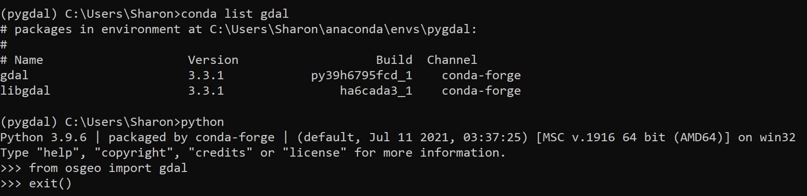

Tutorial: How to Download GDAL with Anaconda.

<!--truncate-->
## Installing GDAL with Anaconda


### Install Anaconda
1. First, you need to have Anaconda installed on your computer, download it here: https://www.anaconda.com/products/individual#Downloads 

2. Second, once you have Anaconda successfully installed open it.

### Create a virtual environment  

<p>We need to create a virtual environment within Anaconda to hold our installation of GDAL. An environment in Anaconda is like a separate space for your code to live in where it will not interfere with other code you have.</p>

1. Run the command: ``` conda create --name pygdal ```
<p>This will create an environment called "pygal" where we will later be installing gdal here. Quick Note: You can name your environment whatever you please, but in this tutorial and the following tutorials I will be using "pygdal" as the environment name. </p>

2. Anaconda will prompt you asking if you want to **proceed[y/n]** : Type ```y```
3. Lastly, run the command: ``` conda activate pygdal```
<p>This command will activate your new  environment named "pygdal".</p>  


### Install GDAL
1.  Inside your virtual environment named "pygdal" run the command:   

```conda install conda-forge gdal```
<p>This will install the gdal package in the environment,"pygdal" you just created.</p>

2. A list of files will pop up and Anaconda will prompt you asking if you want to **proceed[y/n]** : Type ```y```
<p>It will take a few minutes to finish downloading. When it is close to finishing you will see the following:  
</p>
<p>"</p>
<p>Preparing transaction: done</p>
<p>Verifying transaction: done</p>
<p>Executing transaction: done</p>
<p>"</p>

### Verify Your Installation of GDAL
1. Run the command: ``` conda list gdal```
<p>This command verifies we have gdal installed. As you can see in the screenshot below I have version 3.3.1 .</p>

2. Run the command: ``` python```
<p>This opens a python shell we can type commands into.</p> 



3. Run the command: ``` from osgeo  import gdal```
<p>When we downloaded the gdal package we downloaded the entire osgeo library, which includes gdal. You should see output similar to the image below. If you get errors like "import GDAL not found" this means your installation failed.
</p>

4. Run the command: ``` exit()```
<p>This exits the python shell.</p>

5. Congrats!:tada: You successfully downloaded GDAL with Anaconda!


### Helpful Links
1. Anaconda's official Download Page for GDAL: https://anaconda.org/conda-forge/gdal
2. Official GDAL Documentation: https://gdal.org/download.html
