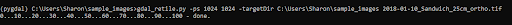
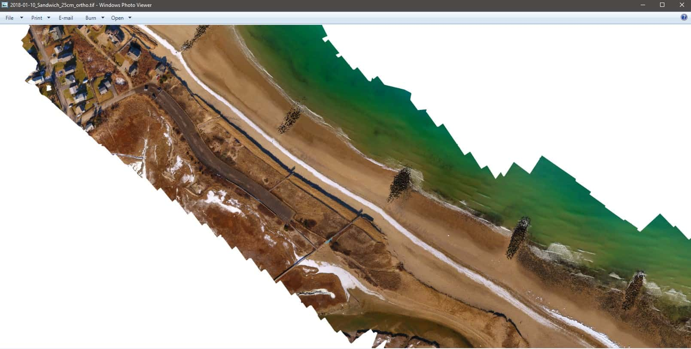
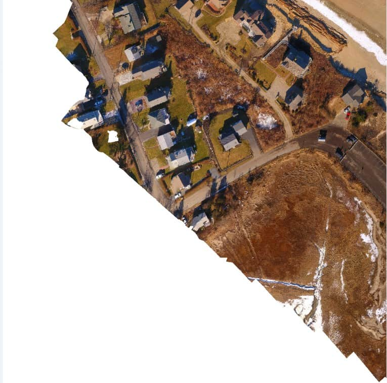
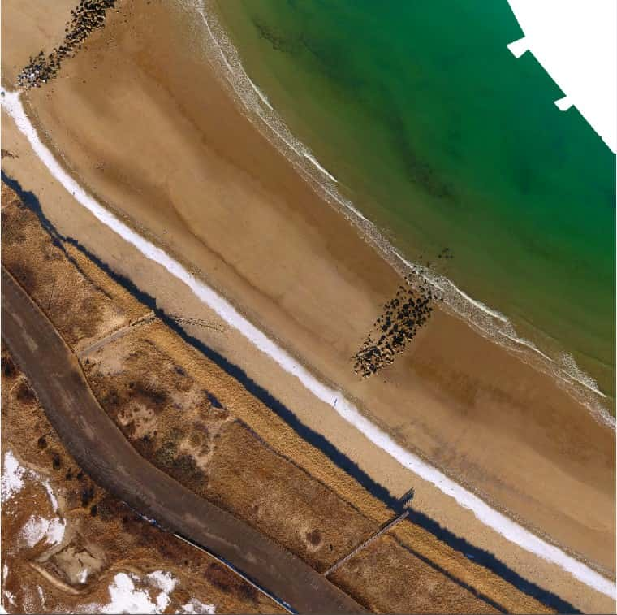
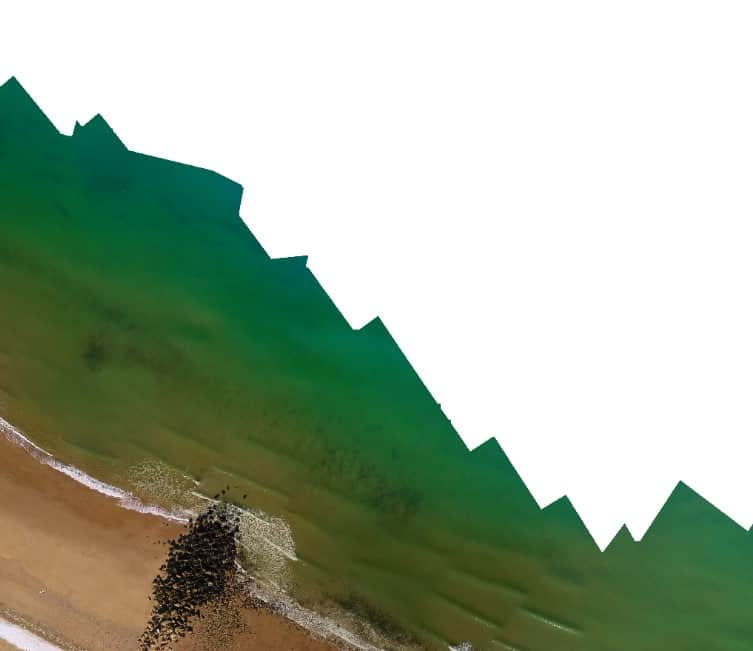

Tutorial: How to Retile an image with GDAL.

<!--truncate-->
## Retiling an Image with GDAL

## Before  you begin
:exclamation: Make sure  you have GDAL installed. :exclamation: <br  />
 If you don't have GDAL installed see my other article on [Downloading GDAL with Anaconda](../19/Download-GDAL)


### Install Anaconda
1. First, open Anaconda.

2. Activate the environment for GDAL you made earlier. Mine is called “pygdal”. Run the command:
``` conda activate pygdal ``` <br  />
- You can see how to create a virtual environment in python in my article [Downloading GDAL with Anaconda](../19/Download-GDAL)

3. Switch into the directory containing your tiff. Use the command:
*** cd "<"directory containing your tiff">" *** (This stands for change directory).<br  />
 For myself my .tiff file is in *C:\Users\Sharon\sample_images* directory so I used the following command to switch into that directory:  

 ``` cd C:\Users\Sharon\sample_images ```

4. Run the following command:

 ```gdal_retile.py -ps 1024 1024 -targetDir C:\Users\Sharon\sample_images 2018-01-10_Sandwich_25cm_ortho.tif```

Make sure to place a space in between the name of your target directory and the name of your .tiff file.
- My target directory: *C:\Users\Sharon\sample_images* 
- My .tiff file name: *2018-01-10_Sandwich_25cm_ortho.tif.*

5. This command transforms your .tiff file into several smaller tiffs each with pixel dimensions 1024 x 1024. 
<p>
Don’t worry your original .tiff file is still there in addition to the new .tiff files that you created.</p>



#### Example .tiff file images

*** Full .tiff  Image ***


*** Retiled .tiff  Images ***




6. Congrats!:tada: You successfully retiled your image!


### Helpful Links
1. More examples: https://docs.geotools.org/stable/userguide/unsupported/imagemosaic-jdbc/prepare.html
2. Official GDAL Documentation for the retile command: https://gdal.org/programs/gdal_retile.html
