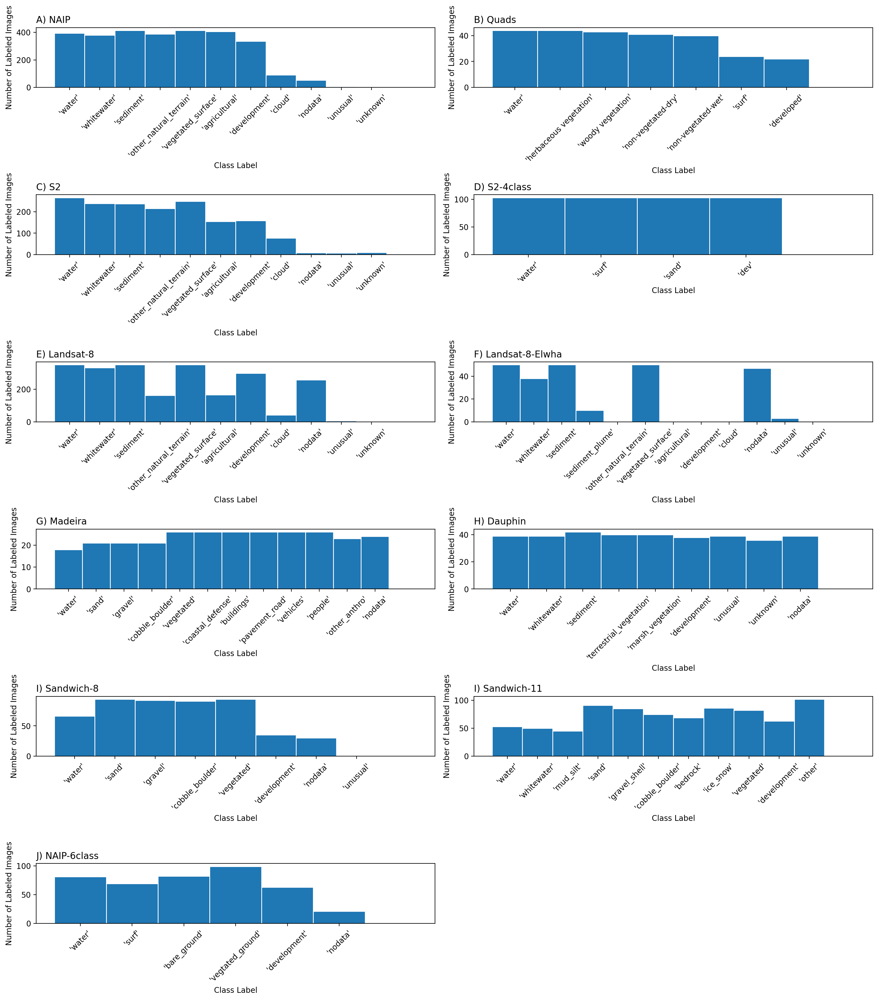
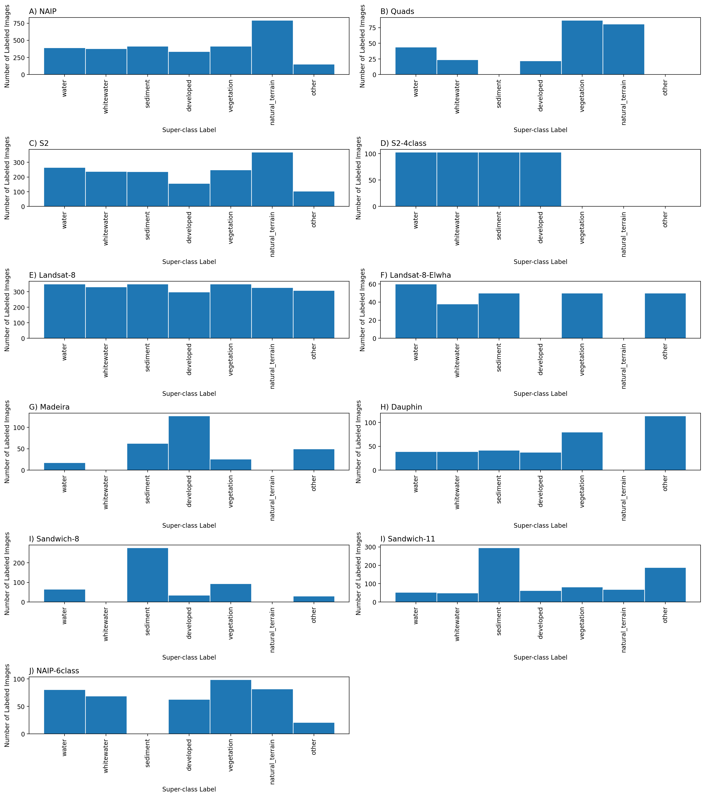
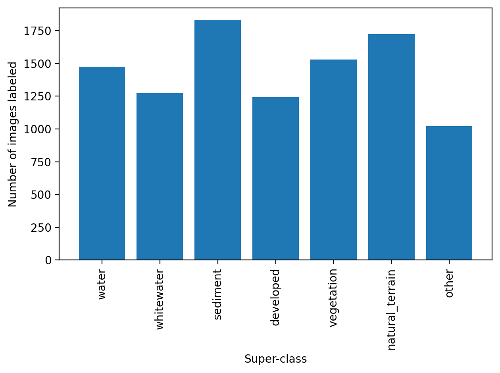

# Classes

## Graphical summary

### Class distributions

Figure: Frequency distribution of images labeled by class label. 

### Superclass distributions
The per-set frequency distributions of labeled images by superclass label vary considerably

Figure: Frequency distribution of images labeled by superclass label. We define a superclass as a broad class name for a collection of component classes. There are seven superclass labels, and between four and 12 class labels depending on the dataset. Hence the empty bars in some of the frequency histograms shown. Computer codes are provided that generate superclass label image sets.

The summed frequency distributions of all labeled images by superclass label are somewhat even, with all seven superclasses represented by between ~1000 and ~1800 images. 

Figure: Frequency distribution of all images labeled by superclass label. 

## Determining class sets

Classes were determined as a result of intercation with the Coast Train expert panel meeting on June 17, 2021. We convened an invited panel consisting of experts on topics concerning coastal imagery, Land-Use Land-cover (LULC) and Machine Learning (ML) experts. The main decisions made as a result of that meeting were:

1. to create a custom class set or two per image type, using a short list of simple (broad/elemental) classes, with the option to build complexity later (i.e. a hierarchical labeling approach).

2. to ideally always include 'water' and 'whitewater' as categories.

3. to define class sets that could be combined into meaningful superclasses. 

4. to label only what we are confident about, to maximize true positives in the training data by including relatively simple and unambiguous classes and a probability sink (unknown/uncertain) class. 

A superclass as a broad class name for a collection of component classes. For some image sets we adopted a suggestion of using an ‘unusual’ class to describe things that are not in the class set but occasionally appear in the scene. 

#### “What coastal science questions/topics could be immediately addressed using the Coast Train dataset?”
Participants were encouraged to answer this question in light of other known datasets and initiatives like C-CAP. A summary of identified and discussed topics are listed below

* Mudflats and marshes - shoreline change, and changes in bare area. Mangrove expansion into marshes.
* Beaches and dunes - capturing any change such as after storm events and restoration efforts
* Habitat succession, heterogeneity, and complexity
* Ghost forests - saltwater intrusion and dieback

The group collectively agreed that consensus is key in any scientific application: errors must be minimal, therefore categories should be broad. Also, there was a consensus that a basic utility of Coast Train will be to generate gridded info for input or validation for numerical simulations of, for example, flooding, roughness, erodability, or vegetation change.

#### "What set of classes/labels best collectively serve the identified science questions/topics?"

Numerous class sets were discussed and those suggestions collectively informed the class sets listed on this site for use with specific data sets/types. A number of over-arching recommendations were also made with respect to class set determination, which are summarized in brief below

* Time scale is very important to the science question
* Consequently, feasibility in usage of map-based products for science are focused on imagery temporal and spatial resolution
* Change itself can be a driver in science questions; unexpected categories (presence or absence of classes); unexpected class boundaries
* Higher resolution datasets are important to consider even if working at the moderate resolution
* Detecting storm impacts could be problematic since areas different than from a non-disturbed point in time.
* High-resolution imagery has fewer mixed pixels and resolves transition areas better, so labeling with the highest resolution is good, but not all categories transfer to lower-resolution imagery

#### List of design criteria established as a result of the meeting

1. Context is important: images should be viewed in time-series where possible, and GIS and base imagery (Google Earth, etc) should be used for context
2. Label what we are confident about (only), to maximize true positives in the training data
3. Use a short list of simple (broad/elemental) classes – start simple and build complexity later (a hierarchical labeling approach)
4. There should be a probability sink (unknown/uncertain) class; if multilabel, it could encode candidate classes
5. Consider a ‘unusual’ class – things that are not in the class set but occasionally appear in the scene
6. Where possible, labels at high-resolution could be transferred to lower resolution imagery, to catalogue mixed pixels for lower-res. Imagery
7. Splitting classes harder/less consensus than lumping classes, in general
8. Avoid ordinal classes, but vegetation presence/absence requires making a call based on sparseness – develop a visual guide (manual) to help with consistency
9. Higher resolution datasets are important to consider even if working at the moderate resolution; aggregate to large spatial scales where appropriate
10. Develop a consistent strategy for ‘developed open spaces’ like agricultural land, golf courses, waterparks, etc – these are land cover, not land use.

The class sets that were determined as a result of this fruitful discussion are found in the `Classes' tab of the sidepane.

