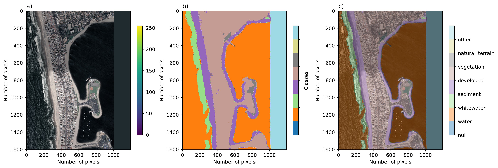
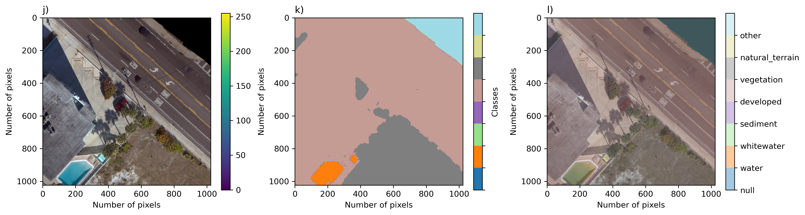
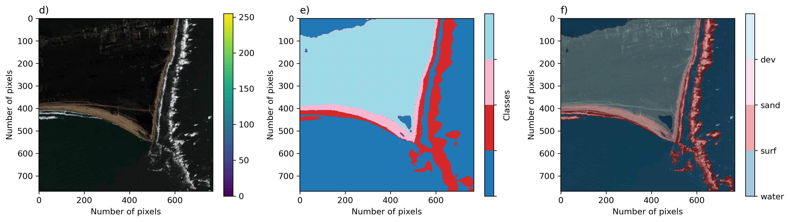
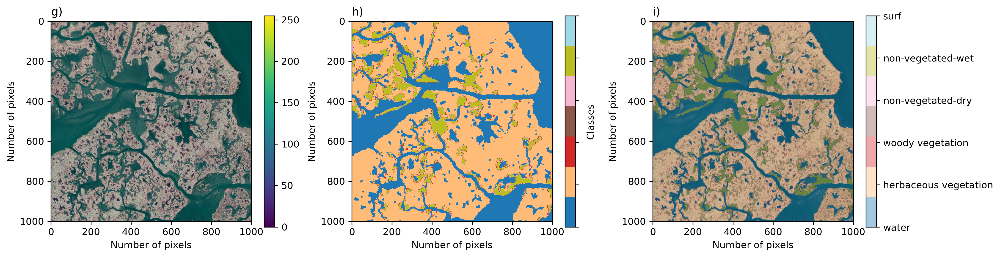
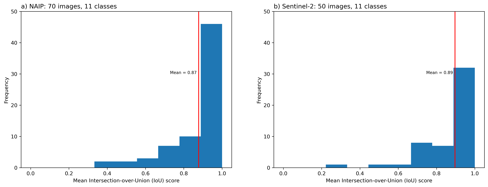
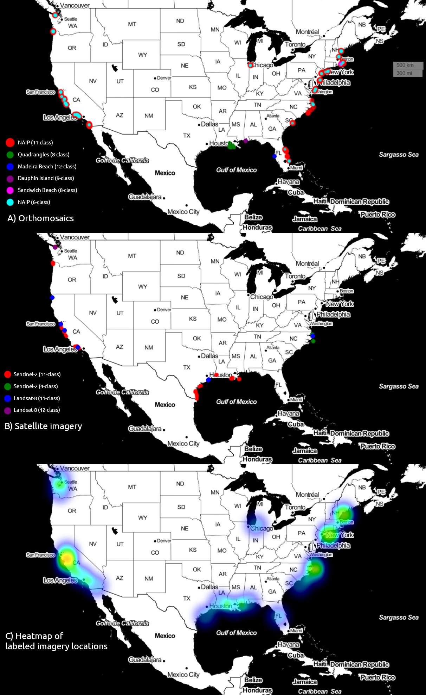
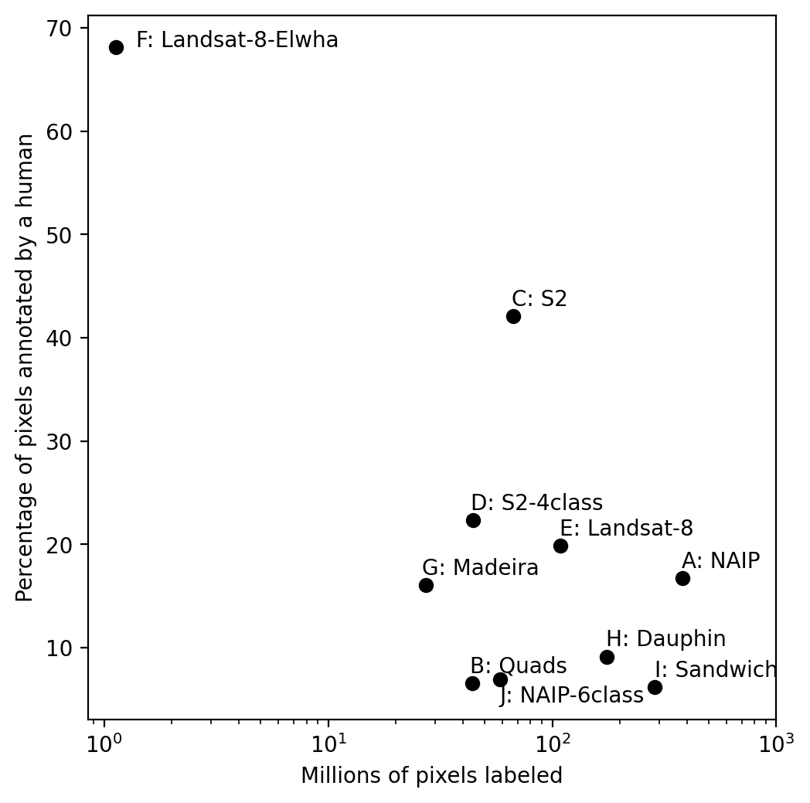
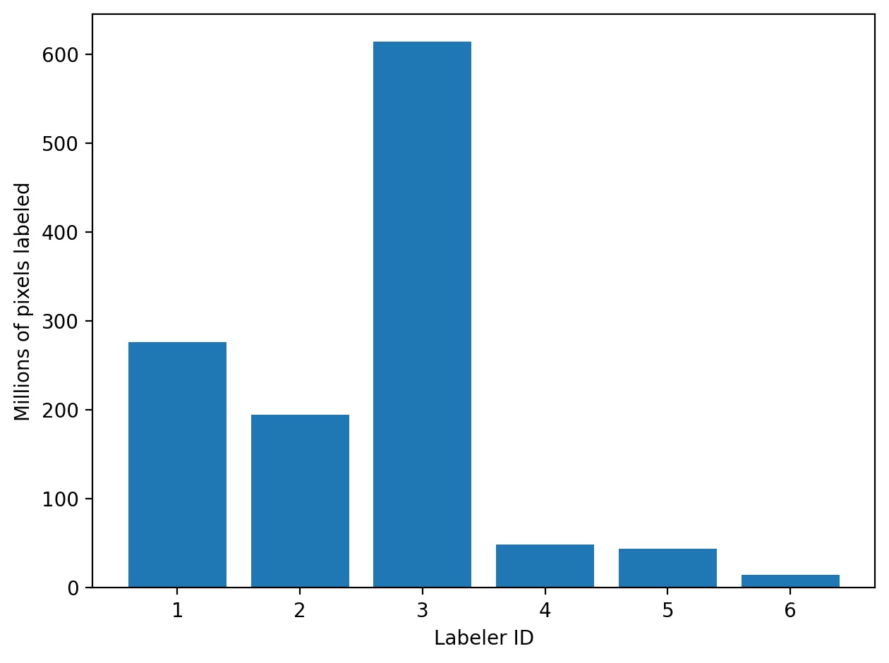

# Overview

While there are many potential types of imagery we could use, the Coast Train project has settled on the following types of imagery because they collectively represent a majority of use-cases and scales.

Version 1 contains Geospatial Imagery only. These data consist of spatial and time-series, and contain 1.2 billion labelled pixels, representing over 3.6 million hectares. We use a Human-in-the-Loop tool especially designed for rapid and reproducible Earth surface image segmentation. 

The dataset consists of 10 data records. Each dataset is associated with a specific image type, and specific label categories. Among the sets, horizontal spatial resolutions range between 0.05m and 1m for orthomosaics, and either 10m or 15m for satellite imagery. All image sources are publicly available.
1. NAIP (aerial)
2. Sentinel-2 (satellite)
3. Landsat-8 (satellite)
4. U.S. Geological Survey (USGS) Quadrangle (aerial)
5. Unmanned Aerial Survey (UAS) -derived (aerial) orthomosaic imagery. 

Each data record is characterized principally by the combination of image type and class set. The study was confined to locations within the conterminous United States (CONUS), and locations related to various historical and present USGS research objectives within coastal hazards and ecosystems research were prioritized. 

We included a set of relatively recently published sets of high-resolution orthomosaic imagery created from aerial imagery collected from following a Structure-from-Motion workflow in addition to geospatial satellite imagery data available throughout CONUS. The orthomosaics are locationally specific data collectively represent muddy, sandy, and mixed-sand-gravel beaches and barrier islands, in developed and undeveloped settings.

The number of label categories varies between four and 12. The dataset consists of 1852 individual images, comprising 1.196 billion pixels, and representing a total of 3.63 million hectares of Earth’s surface. Most image sets are composed of time-series from specific sites, ranging between two and 202 individual locations. Other imagery covers an area at one specific time. Using the labeling program Doodler49 that we created for creation of this and similar datasets50, the number of pixels annotated directly by a human labeler was just over 169 million, out of over 1192 million pixels classified in total, or just over 14 percent (Table 1, Figure 4). Each labeler performed on-the-fly quality assurance through diligent usage of the labeling tool.

## Geospatial Imagery

1. NAIP
The dataset consists of 1-m NAIP imagery. There are 493 images depicting 366 unique locations.

Cloudless 1-m NAIP orthomosaic imagery was collected at various times in summer between 2010 and 2018. 

Images are either 3-band (RGB) or 1-band (near-infrared) of the same extent. For each jpg file, there is a .wld file (ESRI world file format) and a aux.xml file containing all relevant coordinate system reference information for that image.

2. Orthomosaics
The dataset consists of 5-cm orthomosaic imagery created from low altitude (<100 meters above ground level) nadir imagery using SfM processing, with variable coverage. The large ortrhomosaics have been tiled into 1024x1024x3 pixel images in jpeg format. 

3. Satellite imagery

Sentinel-2 imagery was collected over the period 2017-2020, and Landsat-8 imagery over the period 2014-2020. All Landsat imagery were pan-sharpened using a method based on principal components of the 15-m panchromatic band, resulting in 3-band imagery with 15-m pixel size. Visible-band 10-m Sentinel-2 imagery was used. Visible-spectrum (blue, green, and red bands) imagery were labeled, which was necessary to identify all the various classes.

4. Quads
USGS quadrangle imagery43 depict mud-dominated delta and wetland environments of the Mississippi delta in Louisiana, collected in summer 2008 and 2012. 

USGS Digital Ortho Quadrangle imagery of coastal wetlands in the Gulf. See [here](https://www.usgs.gov/faqs/what-a-digital-orthophoto-quadrangle-doq-or-orthoimage?qt-news_science_products=0#qt-news_science_products)

## Summary graphics

### Inter-labeler Agreement

We computed mean Intersection over Union (IoU) scores for quantifying inter-labeler agreement. We use 120 images across two datasets, namely NAIP (70 image pairs) and Sentinel-2 (50 image pairs), that have been labeled independently by our most experienced labelers

Figure: Frequency distribution of all images labeled by mean IoU scores, for the a) NAIP-11 class and b) Sentinel-2 11-class datasets. 

### Geographic Coverage

Collectively, the data records have been chosen to represent a wide variety of coastal environments, collectively spanning the geographic range 26 to 48 degrees N in latitude, and 69 to 123 degrees W in longitude. The majority of coastal states are represented. The final dataset contains numerous (but unequal) examples of coasts dominated by rocky cliffs, wetlands, saltmarshes, deltas, and beaches, including rural and urban locations, and low- and high-energy environments. 

Figure: Geographical distribution of A) orthomosaic and B) satellite imagery, and C) the ‘heatmap’ of image locations, or the number of images in spatial bins.

### Annotation density

The percentage of pixels directly annotated by a human also varies considerably among individual datasets. The percentage of pixels annotated and total pixels labeled are negatively correlated; labelers tend to annotate a larger proportion of lower-resolution scenes.

Figure: The size of the individual datasets, expressed as millions of total pixels labeled, computed as the product of the two horizontal label image dimensions, summed over all labeled images in each set. Percentage of pixels annotated by a human is computed as the product of the two horizontal label image dimensions and the proportion of the image labeled using the labeling program ‘Doodler’, summed over all labeled images in each set. 

### Labeler distributions

The dataset was labeled by three main individuals (ID1, 2, and 3) and certain datasets were labeled by others (ID4 and ID5).

Figure: Frequency distribution of images labeled by unique labeler ID.

