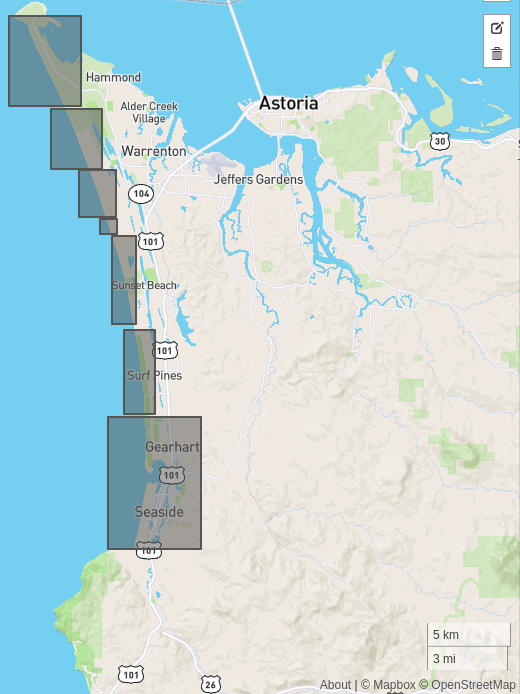
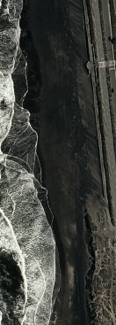
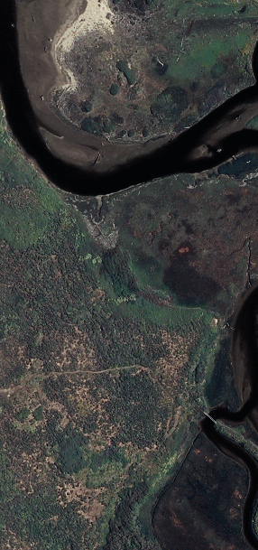
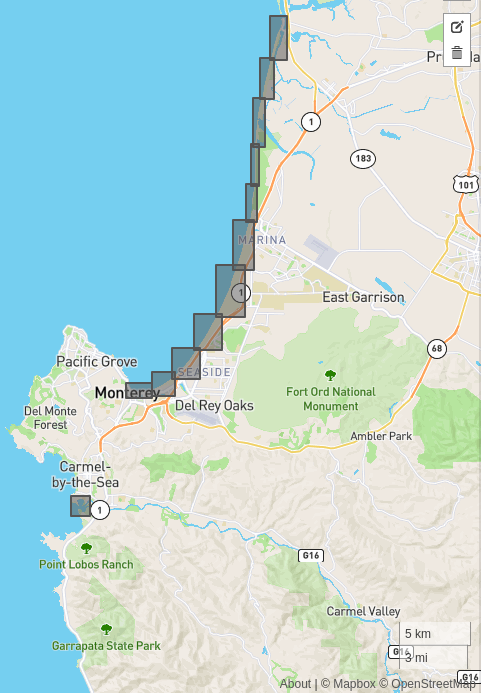
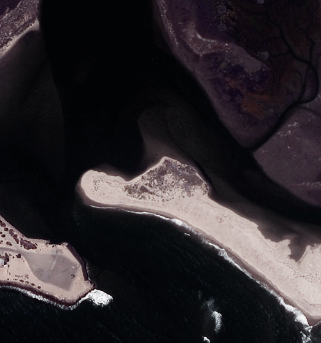
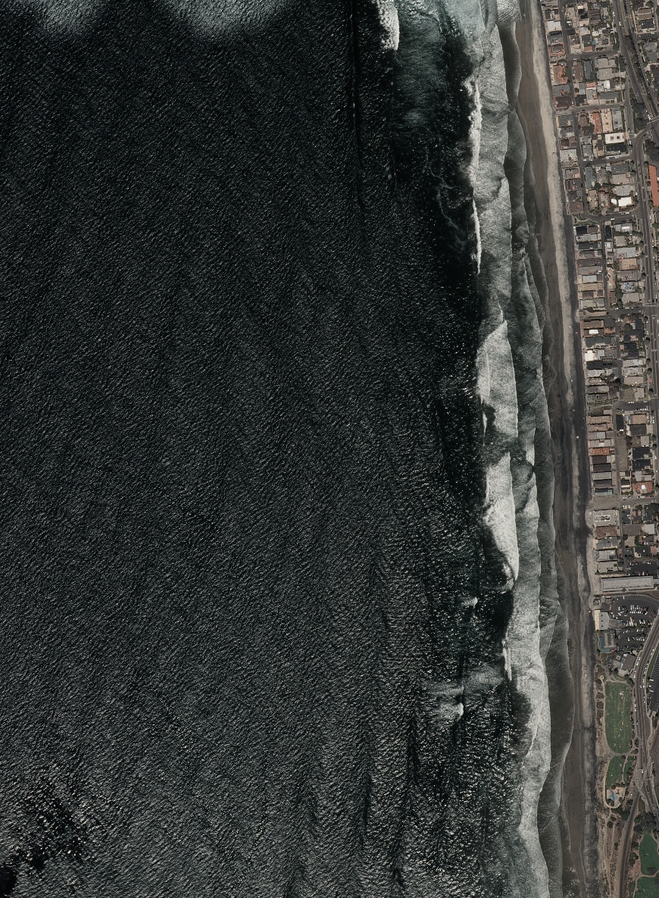

# Pacific Coast

There are eight sites and 64 sub-sites:

Note that all imagery here originates from the National Agriculture Imagery Program or [NAIP](https://www.fsa.usda.gov/programs-and-services/aerial-photography/imagery-programs/naip-imagery/). These 1-m pixel size scenes have been collected between Jan 1 2010 and Dec 31 2020 and are for illustration purposes only, although they do constitute a subset of the full Coast Train dataset (forthcoming).

## 1. Elwha

See [this page](https://www.usgs.gov/centers/pcmsc/science/usgs-science-supporting-elwha-river-restoration-project?qt-science_center_objects=0#qt-science_center_objects) for more details about Elwha River monitoring efforts

### Example 1: -123.566253662,	48.143983157

### Example 2: -123.566253662,	48.143983157

## 2. Columbia River Mouth

This [this report](https://pubs.er.usgs.gov/publication/ofr20201045) for more details about Columbia River monitoring efforts

### Example 1:-123.929763793,	46.000673575

### Example 2: -124.003509521,	46.203592844

<!-- ### Example 3
 -->

## 3. Ocean Beach and Fort Funston

This [this report](https://pubs.er.usgs.gov/publication/70148290) for more details about ongoing Ocean Beach / Fort Funston region monitoring efforts

### Example 1: -122.508441925,	37.738113850

### Example 2: -122.504940032,	37.713538596

## 4. Pescadero

### Example 1: -122.409667968.	37.284323315

<!-- ### Example 2
 -->

### Example 2: -122.336059570,	37.119044184

## 5. Big Sur

### Example 1: -121.433996200.	35.864958674

### Example 2: -121.623355865,	36.093859281

## 6. Monterey

See [this](https://www.usgs.gov/center-news/usgs-surveys-southern-monterey-bay-coast-study-changing-beaches?qt-news_science_products=1#qt-news_science_products) for more details

### Example 1: -121.841022491,	36.631756358

<!-- ### Example 2
 -->

<!-- ### Example 3
 -->

<!-- ### Example 4
 -->

### Example 2: -121.927986145,	36.536674148

### Example 3: -121.792098999,	36.793256839

## 7. Santa Barbara

See, for example, [this report](https://pubs.usgs.gov/of/2009/1029/)

<!-- ### Example 1
 -->

### Example 1: -119.102336883,	34.101797729

### Example 2: -119.271972656,	34.244726235

### Example 3: -119.271972656,	34.244726235

<!-- ### Example 6

### Example 7

### Example 8

### Example 9
 -->

## 8. San Diego
### Example 1: -117.271087646484	32.943915926484

### Example 2: -117.271087646484	32.943915926484

