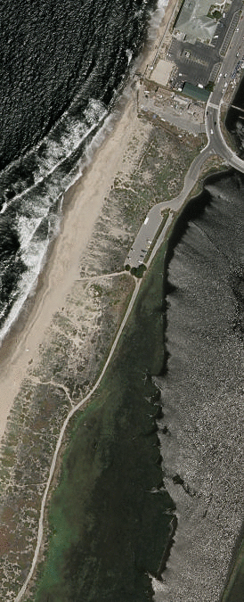

# NAIP Imagery

<!-- 

 -->

### 1. Water
Ocean, lakes, rivers, lagoons, estuaries, creeks, inlets, etc

### 2. Whitewater
This is breaking and broken waves in the surf and swash of open-coast environments, and also whitewater in rivers.

### 3. Sand
On beaches, dunes, etc, where it is apparently that the sand is bare or mostly bare (i.e. free from vegetation) - otherwise, use 'vegetated terrain' defined below

### 4. Vegetated terrain - herbaceous
Any natural surface that is significantly vegetated, by herbaceous (non-woody) vegetation such as grasses.

### 5. Vegetated terrain - woody
Any natural surface that is significantly vegetated, by woody vegetation such as trees and shrubs.

### 6. Other natural terrain
Only natural surfaces that are not sand or vegetated, such as steep cliffs

### 7. Developed
Roads, buildings, paved areas such as parking lots, but not parks, golf courses, etc ; they are 'other natural terrain'

### 8. Unusual
Genuine cases for where it is possible to tell what it is, but it is a category not listed. This is usually an 'unusual' thing in the scene. For example, a boat at sea, or an algal bloom, etc. These portions of the imagery will be reclassified later.

### 9. Unknown
Genuine cases where it is impossible to tell, from texture/color and spatial context. Use sparingly
