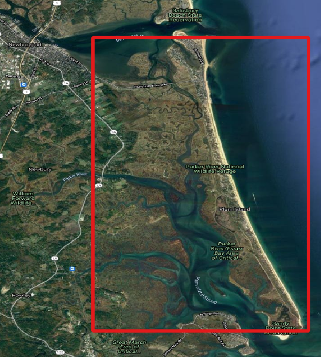
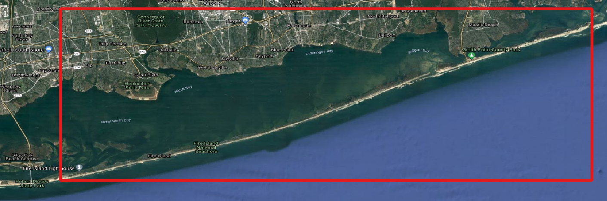
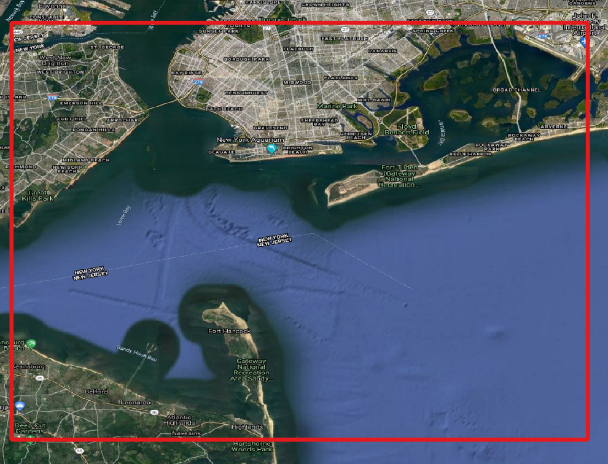
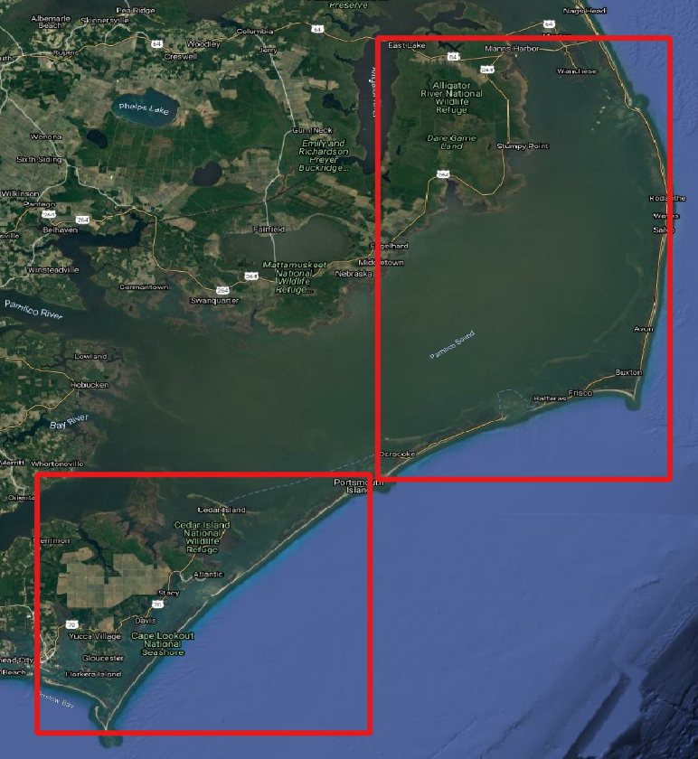
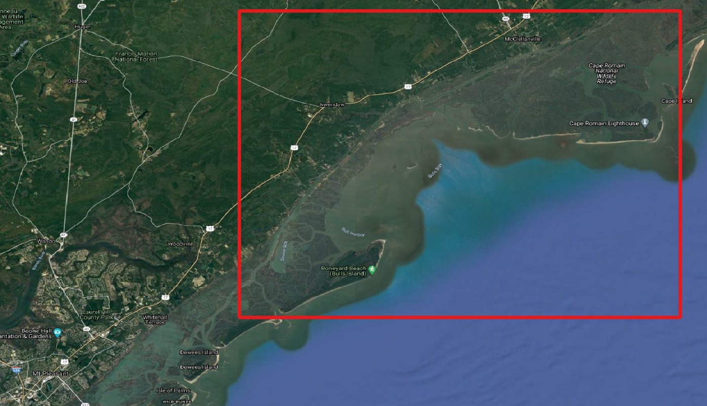

# Atlantic Coast

## Rachel Carson National Wildlife Refuge

## Parker River National Wildlife Refuge

## Cape Code National Seashore and Sandwich Beach

## Fire Island National Seashore

## Coastal New York/New Jersey border

## Edwin B. Forsythe National Wildlife Refuge

### Prime Hook National Wildlife Refuge

### Chincoteague National Wildlife Refuge

### Outer Banks

### Masonboro Island Estuarine Reserve

### Cape Romain National Wildlife Refuge

### Canaveral National Seashore

### Pelican Island

### Biscayne National Park

