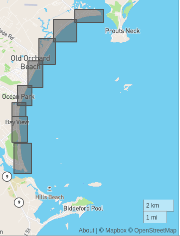
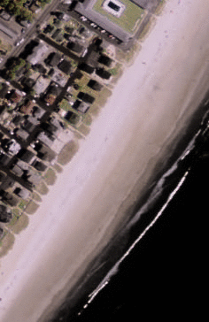
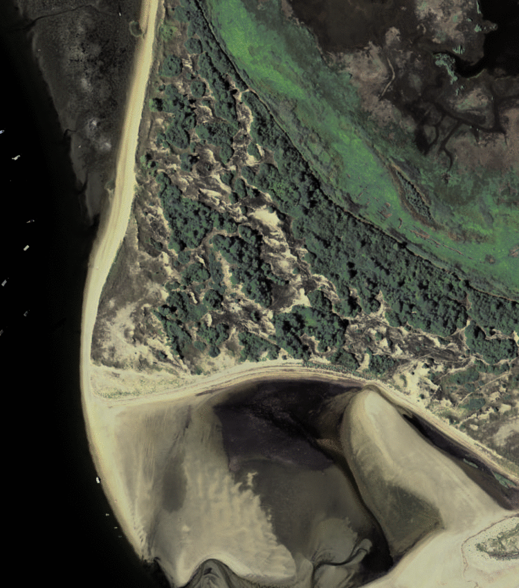
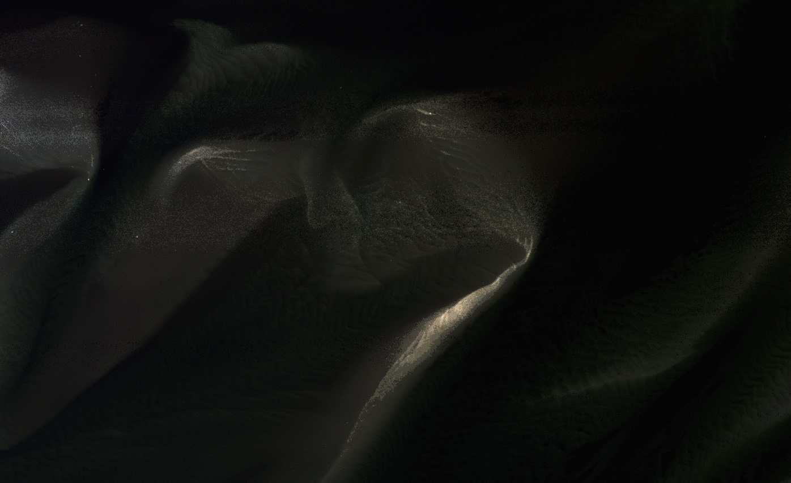
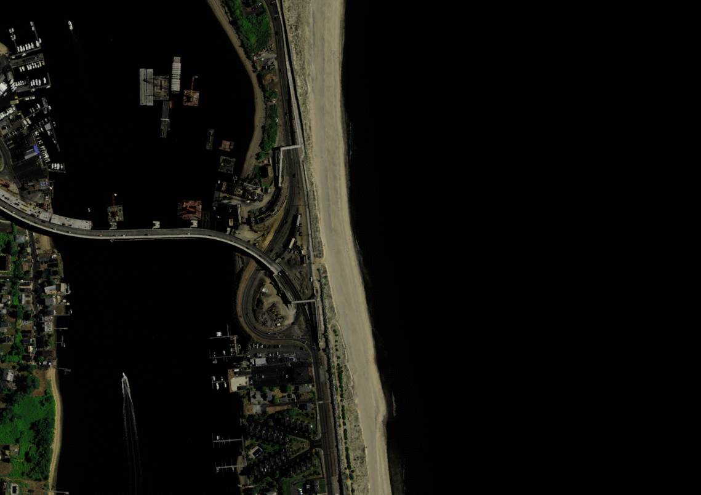
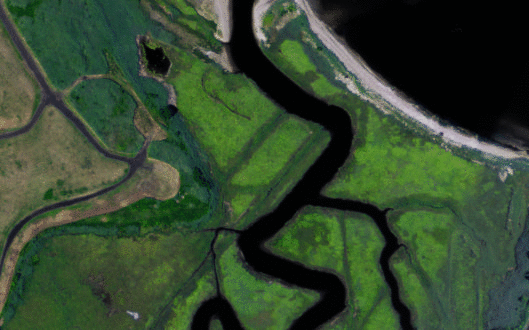
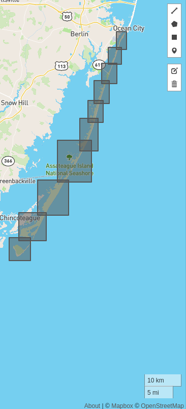
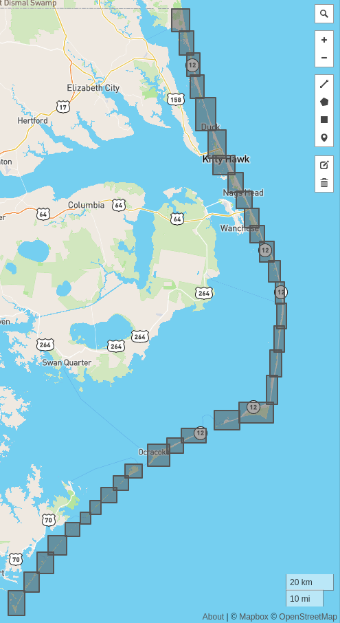
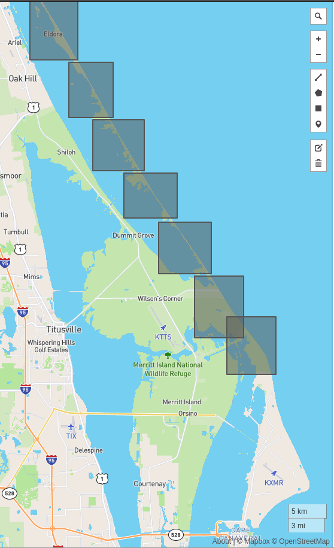

# Atlantic Coast

There are 13 sites and 114 sub-sites:

Note that all imagery here originates from the National Agriculture Imagery Program or [NAIP](https://www.fsa.usda.gov/programs-and-services/aerial-photography/imagery-programs/naip-imagery/). These 1-m pixel size scenes have been collected between Jan 1 2010 and Dec 31 2020 and are for illustration purposes only, although they do constitute a subset of the full Coast Train dataset (forthcoming).

## Rachel Carson National Wildlife Refuge

### Example 1: -70.384357452,	43.468219321

### Example 2: -70.355552673,	43.532445950

## Parker River National Wildlife Refuge

### Example 1: -70.806129455,	42.759817906

### Example 2: -70.789855957,	42.712106956

## Cape Code National Seashore and Sandwich Beach

### Example 1: -69.947410583,	41.846956146

### Example 2: -69.947410583,	41.846956146

## Fire Island National Seashore

### Example 1: -72.968719482,	40.695631511

### Example 2: -73.291030883,	40.622187048

## Coastal New York/New Jersey border

### Example 1: -74.044349670,	40.417259504

### Example 2: -74.123657226,	40.442242404

## Edwin B. Forsythe National Wildlife Refuge

### Example 1: -74.320037841,	39.479871575

### Example 2: -74.421661376,	39.373897717

<!-- ### Prime Hook National Wildlife Refuge
 -->

## Chincoteague National Wildlife Refuge

### Example 1: -75.178070068,	38.154533696

### Example 2: -75.107345581,	38.305346298

## Outer Banks

### Example 1: -76.219848632,	34.92861108

### Example 2: -75.88284301,	36.505432900

### Example 3: -75.88284301,	36.505432900

<!-- ### Masonboro Island Estuarine Reserve
 -->

## Cape Romain National Wildlife Refuge

### Example 1: -79.283386230,	33.135238218

### Example 2: -79.49047851,	33.028915477

## Canaveral National Seashore

### Example 1: -80.714080810,	28.742373958

### Example 2: -80.674530029,	28.689018475

## Pelican Island

### Example 1: -80.442031860,	27.824683262

### Example 2: -80.460777282,	27.865301132

## Biscayne National Park

### Example 1: -80.238098144,	25.403825995

### Example 2: -80.112030029,	27.01594378

