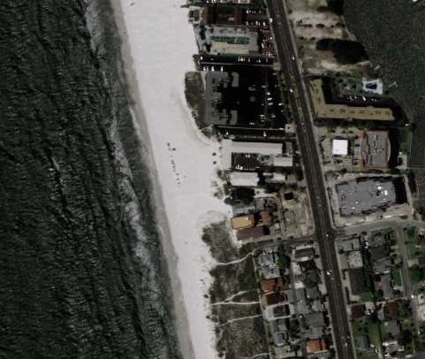

# Gulf Coast

There are eight sites and 48 sub-sites:

Note that all imagery here originates from the National Agriculture Imagery Program or [NAIP](https://www.fsa.usda.gov/programs-and-services/aerial-photography/imagery-programs/naip-imagery/). These 1-m pixel size scenes have been collected between Jan 1 2010 and Dec 31 2020 and are for illustration purposes only, although they do constitute a subset of the full Coast Train dataset (forthcoming).

## 1. Tampa Bay

### Example 1: -82.728424072,	27.638028088

<!-- 

 -->
<!-- 

 -->

### Example 2: -82.683517456,	27.432233336

## 2. Apalachee Bay

### Example 1: -84.352478027,	30.070508324

### Example 2: -84.270080566,	30.091899646

<!-- 
 -->

## 3. Gulf Barrier Islands

### Example 1: -89.100219726,	29.534025189

### Example 2: -88.987884521,	29.652725587

### Example 3: -88.953002929,	30.216587667

<!-- 

 -->

## 4. Eastern Mississippi Islands

### Example 1: -89.278884887,	29.187392060

### Example 2: -88.490753173,	30.207329400

<!-- 

 -->

## 5. Western Mississippi Delta

### Example 1: -90.647369384,	29.323008926

### Example 2: -90.776184082,	29.423997069

### Example 3: -90.901977539,	29.307201920

<!-- chunk39_site65_ts.gif -->

## 6. Sabine National Wildlife Refuge

### Example 1: -93.561767578,	29.897061994

### Example 2: -93.728210449,	29.891099510

## 7. Aransas and 8. Laguna National Wildlife Refuges, and Padre Island National Seashore

### Example 1: -97.4476318359,	27.361917636

### Example 2: -97.441040039,	26.707255888

